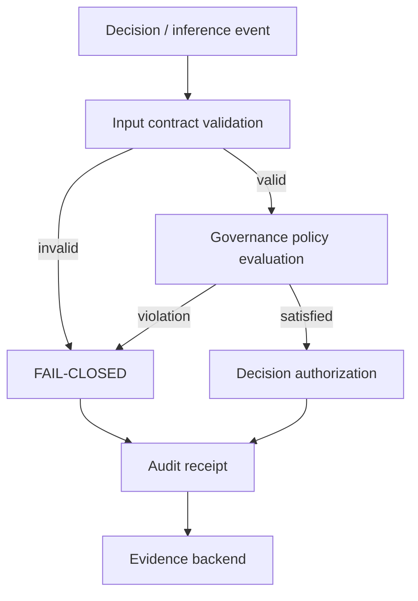

# Architecture

## Logical control path

## Architectural properties

### Fail-closed semantics

Malformed, incomplete, or policy-violating input must not be interpreted as success.

### Explicit contracts

Controls should be machine-evaluable. A policy statement that cannot be evaluated should not silently degrade into an advisory warning.

### Evidence separation

The authorization decision and its evidence are distinct outputs. Evidence should be independently inspectable and integrity-verifiable.

### Deterministic public receipts

The reference demonstration canonicalizes receipt payloads and hashes them with SHA-256. Production cryptographic design belongs to the private implementation and must be evaluated separately from this public sample.

### Layered disclosure

The public surface is intentionally the first disclosure layer. Deeper implementation review should be scoped to the evaluator's actual use case.
